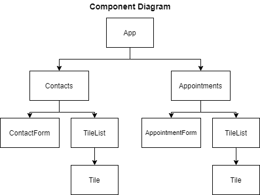

# **Booked**

Booked stores contacts and appointments. This app is a [Codecademy](https://www.codecademy.com/learn/react-101) project intended to enhance my skills on the use of React, Jest and Enzyme.

## Table of Contents

- [Project Prompt](#codecademy-project-prompt)
- [Technologies](#technologies)
- [Setup](#setup)
- [Sources](#sources)

## Codecademy Project Prompt

In this project, you will use functional React components to create an app that manages contacts and appointments. The app consists of two pages: one to view and add contacts and one to view and add appointments.

You will work with stateful and stateless functional React components using hooks. The requirements section will walk through implementing the app from the topmost component down. If you would like to implement it in a different order feel free to do what is comfortable for you.

To complete this project, you should have completed the Codecademy lessons from [Learn React](https://www.codecademy.com/learn/react-101) including:

- JSX
- React Components
- Components Interacting
- Stateless Components From Stateful Components
- Advanced React
- Hooks

## Technologies

- React
- JavaScript

## Setup

To view the final output, click [here](https://daniellabrador.me/codecademy-react-booked).

## Sources

The techniques utilized was based on the lessons taught in [Codecademy's Learn React Course](https://www.codecademy.com/learn/react-101). The challenge is also provided by Codecademy.
